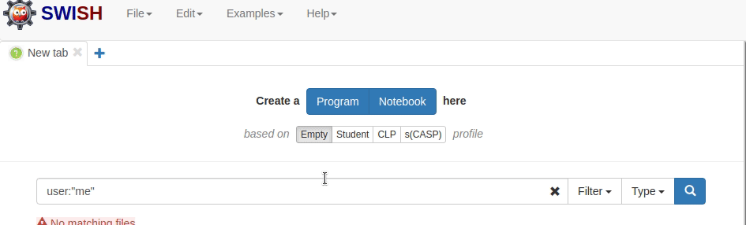

# Notebooks para las clases de Prolog

## Para importar estos notebooks

1. Ingresar a https://swish.swi-prolog.org
2. Crear un nuevo notebook
3. Agregar un componente
4. Presionar en "more"
5. Agregar el archivo correspondiente

### Visualmente

